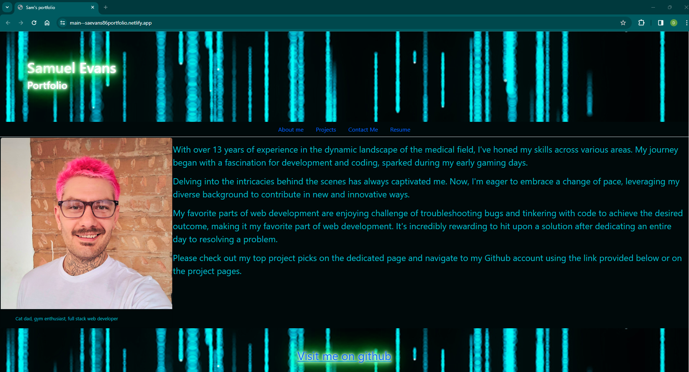

# Title 
New-Portfolio

## Description who/what/when/what/why
I created the reactjs portfolio to showcase some of the skills I've picked up along my journey beginning web developement.
With just a week under my belt using reactjs, I'm really excited to see how far this project portfolio has come along, and its been
extremely nice getting to work in CSS again. Some of my initial struggles with react were the component pages and how they were interacting with each other. I still have a lot more to learn with react, but it feels like such a clean language compared to some of my previous projects, it was an enjoyable challenge. 

## Table of Contents (Optional)

- [Installation](#installation)
- [Usage](#usage)
- [Credits](#credits)
- [License](#license)

## Installation 
If you wish to run this locally, yoy can clone from github and run npm install, and npm run dev to start the application. 

## Usage 
Visit my portfolio here 
https://main--saevans86portfolio.netlify.app/

    

## Credits 
- Trever and Jacek the TA's from class
- Ntombi from ASKBCS
- react docs
- https://stackoverflow.com/questions/45596329/display-pdf-in-reactjs
- docs from in class activities 

## License 

## License Link 
[license: MIT](https://opensource.org/licenses/MIT)

---
# License section 

  Copyright 2023 NewPortfolio
  
  Permission is hereby granted, free of charge, to any person obtaining a 
  copy of this software and associated documentation files (the “Software”),
  to deal in the Software without restriction, including without limitation the rights
  to use, copy, modify, merge, publish, distribute, sublicense, and/or sell copies 
  of the Software, and to permit persons to whom the Software is furnished to do so, 
  subject to the following conditions:
  The above copyright notice and this permission notice shall be included in all copies 
  or substantial portions of the Software.
      
  THE SOFTWARE IS PROVIDED “AS IS”, WITHOUT WARRANTY OF ANY KIND, EXPRESS OR IMPLIED, 
  INCLUDING BUT NOT LIMITED TO THE WARRANTIES OF MERCHANTABILITY, FITNESS FOR A PARTICULAR PURPOSE AND NONINFRINGEMENT. 
  IN NO EVENT SHALL THE AUTHORS OR COPYRIGHT HOLDERS BE LIABLE FOR ANY CLAIM, DAMAGES OR OTHER LIABILITY, WHETHER IN AN ACTION OF CONTRACT, 
  TORT OR OTHERWISE, ARISING FROM, OUT OF OR IN CONNECTION WITH THE SOFTWARE OR THE USE OR OTHER DEALINGS IN THE SOFTWARE.
      

## Features 
This simple, yet effective portiolio allows page viewes to nagivate through about me, projects, contact me, and view/print/download resume. The contact section does send me e-mails through the emailjs app. The resume page is finicky and requires a reload, but should work on page load. 

## Tests 
No tests have been ran. 

## Questions 
# Please contact me at:
 github username: saevans86 e-mail: sam_evans1986@hotmail.com
